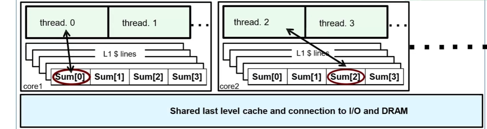
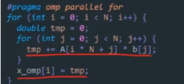
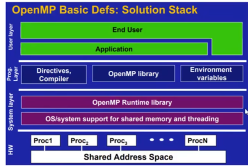
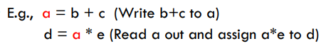
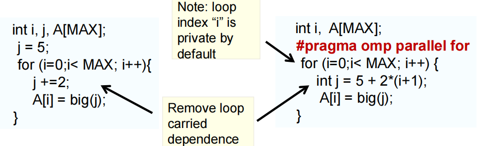
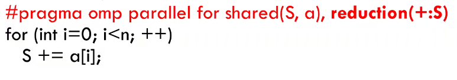
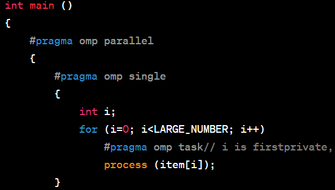
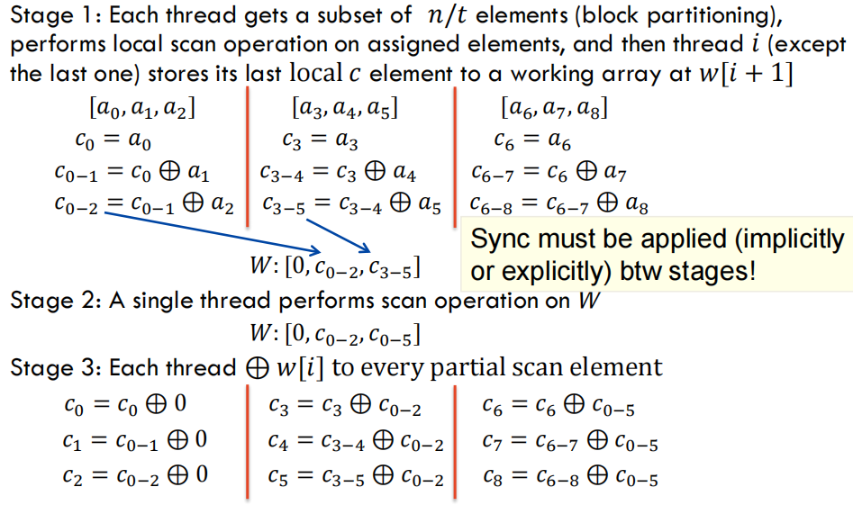

# OpenMP|MPI&#x20;

## 目录

-   [共享存储式并行理念 | 问题](#共享存储式并行理念--问题)
-   [OpenMP](#OpenMP)
    -   [基础使用方法](#基础使用方法)
        -   [子句使用](#子句使用)
        -   [高级用法](#高级用法)
-   [MPI](#MPI)
    -   [MPI调试](#MPI调试)

### 共享存储式并行理念 | 问题

-   **缓存一致性开销**（减少共享变量访存，注意尽量指定数据 share或private）

    在openmp划分的共享空间中，存在由于缓存一致性导致的开销问题：（也是伪共享问题）
    -   每个核心都有自己的L1 L2缓存，共享L3缓存

        
        sum扩展为一个数组之后作为一段连续的内存缓存到一个cacheline中，当不同核上面的多个线程写入数据时, cacheline中的数据在不同核之间等待,造成缓存一致性开销
    -   &#x20;**通过将该数组中的数据 放置到 不同的L1 cache中，也就是改成二维数组**
    -   &#x20;对于多层循环， 用一个临时变量存储 然后在循环结束时再赋值

        
-   **基本定义**

    线程级别管理

    

    fork-join  单线程(initial thread)，开始执行进入并行区(parallel region)，开始并行执行在并行区结尾进行同步和结束线程,继续单线程执行程序
-   **循环依赖**

    Flow 依赖是真正的依赖（RAW）

    

    只要紧挨的两次迭代没有依赖，就有并行空间 （改变循环顺序，变量替代等等）

    循环划分的方法：行划分，列划分，循环划分，块划分（并行度最高）
    -   循环交换（空间局部性访存，尽可能将循环 紧凑地按行访存）
    -   可通过循环重构来解决依赖问题

        <https://blog.csdn.net/qq_40765537/article/details/106098554>

        循环划分，用临时变量存储边界（scan并行）
        -   让j只依赖于i

            
-   **有锁与无锁关系**：

    锁竞争导致的cpu饥饿现象（其他线程等待锁释放时产生的时间开销），造成这种情况的原因可能是操作系统的调度策略，或者是锁的竞争过于激烈。

    死锁现象是指 多个线程互相等待对方释放资源（相互牵制）。在多核编程中还会存在负载平衡问题

    无锁编程 ： 主要是使用原子操作替代锁，利用精细的线程控制策略来避免资源竞争。

    有锁操作：在openmp中可通过同步操作进行，或者使用omp\_init\_lock等显示加锁与释放
-   负载均衡策略

    对于一些图的并行计算：

    通过**图分割**，我们可以实现负载平衡（使节点权重相同），同时尽量减少通信开销（减少边切割）。这对于并行计算中的任务分配和通信效率至关重要

    有坐标信息的图：可以用惯性二分法等等

    无坐标信息：比如WWW模型，网页是图顶点

    图划分与计算时要针对不同问题，权衡时间与答案；另外，比如稀疏矩阵的计算中图划分的时间必须小于计算时间
-   **混合优化**

    使用**中层循环**（因为对列展开，提高cache命中率，效果更好）展开+openmp对外层进行**parallel （dynamic）**，不同的计算节点之间使用mpi进行通信

## OpenMP

### 基础使用方法

程序开始时只有一个主线程，程序中的串行部分都由主线程执行，并行的部分是通过派生其他线程来执行，但是如果并行部分没有结束时是不会执行串行部分的，即fork/join式机制

openmp很灵活，在不同的并行区与任务量的情况下可以合理的调整线程数（多核之间多线程运行），而mpi（分布式）却不行，在启动前，大的划分区域已经确定了。

openmp函数指南 [https://zhuanlan.zhihu.com/p/399591700](https://zhuanlan.zhihu.com/p/399591700 "https://zhuanlan.zhihu.com/p/399591700")

***

**示例教程：**

<https://blog.csdn.net/drzhouweiming/article/details/4019792>

-   存在数据竞争问题，用同步操作；**控制线程数量 ，调度 ， 同步 与 互斥**；编译选项 使用 **-fopenmp** ；
-   获得并行域中可用的最大线程数`omp_set_num_threads`，omp\_get\_wtime()得到时间 。 **要注意变量 类型（私有化与共享），对于共享变量注意（原子操作，写冲突等）**
-   team的概念： 一个parallel区域中的线程集合，代表一个线程组，其生命周期就是该 代码块 的周期

<https://www.zhihu.com/column/c_1174996853811335168>

#### 子句使用

-   **数据处理子句**：私有化变量，共享存储...

    `#pragma omp parallel for private(k)` 是OpenMP的一个指令，它表示创建一个并行区域并在该区域中并行执行接下来的for循环，同时声明变量 `k` 为私有（private）。

    在OpenMP中，变量可以有四种数据共享属性：私有（private）、共享（shared）、第一私有（firstprivate）和最后私有（lastprivate）。
    1.  默认情况下不同区域的共享属性不同
        1.  全局变量和在并行区域外部定义的静态变量默认为共享。这意味着在并行区域的所有线程都可以访问并修改这些变量。
        2.  在并行区域内部定义的变量（即在`#pragma omp parallel `构造内部定义的变量）默认为私有。
        3.  循环迭代变量（即`for`循环中的索引变量）默认为私有
    2.  **私有（private）**：每个线程都有该变量的一个私有副本，各个副本之间互不影响。在并行区域开始时，私有变量的值是未定义的，在并行区域结束时，私有变量的值被丢弃。例如，`#pragma omp parallel private(k)`。
    3.  **共享（shared）**：所有线程共享同一个变量，任何线程对该变量的修改都会影响其他线程。例如，`#pragma omp parallel shared(k)`。
    4.  **第一私有（firstprivate）**：和私有类似，但在并行区域开始时，每个线程的私有变量会被初始化为该变量在并行区域外的值。例如，`#pragma omp parallel firstprivate(k)`。
    5.  **最后私有（lastprivate）**：和私有类似，但在并行区域结束时，该变量在并行区域外的值会被设置为最后一个执行的线程的私有变量的值。例如，`#pragma omp parallel for lastprivate(k)`。
        几种私有的区别就在于 私有变量初始化的时机不同
-   **控制语句：使用section**...

    每个section之间是并行的，需要注意的是这种方式需要保证各个section里的代码执行时间相差不大，否则某个section执行时间比其他section过长就达不到并行执行的效果。

    `#pragma omp parallel sections`  是并行执行的，   `#pragma omp sections`而这个只能在已有的并行区域内并行，否则是基于当前线程串行的。

    `sections`块中的`for`循环将被视为一个整体，只能由一个线程执行。
    -   &#x20;reduction后就会进行规约，对每一个线程用本地变量进行拷贝和更新得到部分和，然后

        
        -   `single`：`single`指令用于指定一段只能由一个线程执行的代码，也就是说这段代码只会被更新一次（其他线程会直接跳过，但是会等待）, 可以与 nowait并用来取消等待
-   **任务调度子句Schedule** 调整调度策略，控制负载均衡
    1.  `schedule(static, chunk_size)`：将迭代分成大小相等的块，按照静态顺序分配给线程。如果未指定块大小，则会把所有迭代均等地分配给所有线程。这种方式在迭代的计算时间相对一致的情况下效果较好。
    2.  `schedule(dynamic, chunk_size)`：将迭代分成大小为`chunk_size`的块，然后动态地分配给线程。当一个线程完成了它的块后，它会被分配下一个还未被处理的块。如果未指定块大小，默认大小为1。适用于各迭代间的计算时间差异较大的情况。
    3.  `schedule(guided, chunk_size)`：开始时分配的块较大，随着时间的推移，分配的块会变小，最小为`chunk_size`。如果未指定块大小，默认大小为1。适用于有些迭代在开始时需要更多的计算，而后续需要较少的计算的情况。
    4.  `schedule(auto)`：编译器或运行时系统决定如何分配迭代。这种方式为OpenMP实现提供了最大的灵活性，但也可能导致不可预测的结果。
-   \*\* critical, atomic and barrier 同步操作\*\*（有锁）
    -   nowait子句 取消隐式屏障，指定线程不需要等待其他线程
    -   atomic会导致其他线程阻塞，尽可能多的使用**reduction**而不是同步策略
    -   **Critical**（`#pragma omp critical`）定义一个阻塞区块，慎用
    -   `barrier` 分割线式阻塞，及所有线程都执行到该子句时才会继续
    -   优化锁粒度：如果必须要使用锁，尽量避免长时间持有锁。锁的粒度越小（持有时间越短），越有可能减少锁竞争。例如，你可以尝试在必要的地方使用锁，而不是在整个循环或函数中使用一个大锁。

#### 高级用法

-   openmp对线程的粗粒度控制 | parallel嵌套 ：

    **`#pragma omp parallel proc_bind(close)`**：设置线程亲和性（这种方式不太好说），`proc_bind`的可能值有`close`、`spread`和`master`。`close`表示新的线程被分配给最近可用的处理器，`spread`表示新的线程被分配给尽可能远离其他线程的处理器，`master`表示所有线程都在主线程所在的位置执行。

    或者用 `#pragma omp parallel num_threads()`子句设置并行块的线程数量，，（可以设置环境变量`OMP_NESTED`或者在程序中调用`omp_set_nested(1)`函数来开启）慎用并行块嵌套

    注意parallel嵌套时，里面的会创建一个新的线程组。这个新的线程组是独立于外部的线程组的，也就是说，内部的parallel区域不会使用外部的线程组的线程，但这种也比较容易造成 线程爆炸，导致过度的线程切换和资源竞争。 多个线程并行paralle区块，但在**一个区块中的线程id是一致**的，当使用omp for等语句时才会进行分配。
-   **任务并行**
    -   概述

        有些情况下，数据的分布并不均匀，或者每个小块的计算量并不相同。比如在遍历一个树形结构时，每个节点的子节点数量可能会有很大的差异，这就导致了不规则的并行性。

        任务并行是为了解决这种问题而提出的。在任务并行中，我们将计算任务分解成一系列小任务，然后将这些任务放入一个任务池中。每个线程都可以从任务池中取出一个任务来执行，执行完后再取下一个。这样，即使每个任务的计算量不同，线程也可以根据实际情况动态地调整它们的工作量，从而提高并行效率。

        `task`构造就是用来实现任务并行的。在你的例子中，`traverse`函数为每个节点创建了一个新的任务，这些任务可以由任何可用的线程在任何时间执行。这样，即使树的结构非常不均匀，线程也可以根据实际情况动态地调整它们的工作量，从而提高并行效率。
    -   task与group
        -   `task`指令用于指定一个可以由任何线程在任何时间执行的代码块，遇到task后会进行任务构造，立即执行或推入任务池等其他线程执行。这对于处理不规则的并行性（例如，树的遍历或图的遍历，递归算法）非常有用。`taskgroup`指令用于同步一组相关的任务。当一个线程到达`taskgroup`的结束点时，它会等待该组中的所有任务完成。
        -   group里面可以有多个task，一般是为了同步一组相关的任务，比如需要等待所有任务完成后才能计算结果或更新共享数据结构时就可以用到group。
        -   如果想使用线程分组（组内有锁竞争，而组外没有），可以划分为不同的task。
        -   但是注意根据需要来决定是否在group外面加一层single，取决于是否要保持任务的一次性。
        -
    -   示例

        

        它创建了一个并行区域，在这个区域中，只有一个线程（由`#pragma omp single`指定）会执行循环。在循环中，它为每个元素创建一个新的任务来处理该元素。这里的`#pragma omp task`指令用于创建新的任务，这些任务可以由并行区域中的任何线程在任何时间执行
-   负载均衡策略：

    少量的负载不均衡也会导致 限制最大速度
    -   静态负载分配

        有些问题，如密集矩阵计算，规则网格，可以很容易地分解成许多具有规则数据依赖模式的相等大小的任务，任务分配相对容易。
    -   动态负载分配

        而其他问题，如稀疏矩阵，非结构化网格，图，则更复杂，需要考虑如何平衡工作负载，最小化通信开销和冗余计算
    ***
    using 与typedef不一样的是 可以对class及其他类型 使用
    -   引用类型：`using Vec = std::vector<int>;`，然后就可以使用`Vec`作为`std::vector<int>`的别名。
    -   引用模板类型：`template <typename T> using Vec = std::vector<T>;`，然后就可以使用`Vec<int>`作为`std::vector<int>`的别名
    -   为**类类型**起别名，在派生类中引用基类成员：在类的定义中，`using`可以用来改变基类中成员的访问级别，例如`using Base::foo;`可以将`foo`从基类中提升为公有或保护的。还可以用来引入同名的基类成员，以消除隐藏的情况。
        可变参数列表，需要有一个 重载函数 作为终止函数， 控制递归解包。
    lambda表达式中的动态类型判断`decltype`，一般结合auto使用（也可以在lambda中判断return值）：`auto func() -> decltype(i + j) { return i + j; }`

    一般用auto来存储lambda表达式

    `[x, &y] `   // x 以传值形式捕获，y 以引用形式捕获

    可以用 auto arr\[]={args...}来得到同类型的可变参数列表，也可以 套函数里：{ func(args...)}这样就是返回函数值

**转换到GPU （Devices与target）**

-   **示例代码**
    -   parallel结构
        -   并行区域（`#pragma omp parallel`）：这是并行执行的代码块。
        -   获取线程ID（`omp_get_thread_num()`）：这可以用来区分不同的线程。
        -   并行for循环（`#pragma omp parallel for`）：这使得for循环的迭代可以并行执行。
        -   调度策略（`schedule(static)`）：这决定了如何分配for循环的迭代给不同的线程。
        -   并行归约（`#pragma omp parallel for reduction(+:sum)`）：这使得可以并行地计算一个值（在这个例子中是求和）。
        -   临界区（`#pragma omp critical`）：这是一个只能由一个线程同时执行的代码块。
        ```c
        int thread_id = omp_get_thread_num();
        int num_threads = omp_get_num_threads();
        nums = num_threads;
        int items_per_thread = n / num_threads;  // n 是数组的大小
        int start = thread_id * items_per_thread;

        ```
    -   scan操作 并行实现

        scan是许多相关问题的关键操作，如排序、词法分析、字符串比较、图像过滤。
        -   实现  主要是 将相邻的迭代 划分开 ， 边界用数组存储，中间的那部分用single

            
            -   手动控制线程id
                ```c
                #pragma omp parallel
                    {
                        int s = 2;
                        int thread_id = omp_get_thread_num();
                        int num_threads = omp_get_num_threads();
                        nums = num_threads;
                        int items_per_thread = n / num_threads;  // n 是数组的大小
                        int start = thread_id * items_per_thread;
                        int end = (thread_id + 1) * items_per_thread;
                        end = (thread_id == num_threads - 1) ? n : end;
                        for (int i = start; i < end; i++) {
                            temp[thread_id + 1] += sums[i];
                        }
                //        cout << thread_id << endl;
                #pragma omp barrier
                //第二阶段
                #pragma omp single
                        {
                            for (int i = 1; i <= nums; i++) {
                                temp[i] += temp[i - 1];
                            }
                        }
                // 第三阶段
                        for (int i = start; i < end; i++) {
                            if(i==0)continue;
                            int t=(i==start) ? temp[thread_id]: result1[i-1];
                            result1[i] =t+ sums[i];
                        }
                #pragma omp barrier

                    }
                    
                    ----
                 
                ```
            -   其实第一段也可以这样写，计算次数更少：  因为默认static调度，会按顺序将循环分块计算，而sl是私有变量：
                ```c

                    {
                    int tid = omp_get_thread_num();
                    double sl = 0.0;
                    #pragma omp for
                        for (i = 0; i < N; i++) {
                            sl += s[i];
                            s[i] = sl;
                        }
                         if (tid < nthreads - 1)
                            sw[tid + 1] = sl; //store the last value sl
                ...

                }

                ```

## MPI

<https://zhuanlan.zhihu.com/p/357551507>

<https://www.bilibili.com/video/BV1Mg411P7Bt/?spm_id_from=333.337.search-card.all.click&vd_source=e82fc2d30a877ed4b843d047ccf3af82>

<https://mpitutorial.com/tutorials/mpi-introduction/zh_cn/>

<https://www.open-mpi.org/doc/current/>

### MPI**调试**

[调试 |较通用的策略](https://www.wolai.com/o9shXnjFT6eYvDe8LJeEeH "调试 |较通用的策略")

<https://www.dazhuanlan.com/young_miko/topics/1416298>

<https://blog.csdn.net/weixin_44259984/article/details/129562790?ops_request_misc=&request_id=&biz_id=102&utm_term=mpi程序怎么进行调试&utm_medium=distribute.pc_search_result.none-task-blog-2~all~sobaiduweb~default-0-129562790.142^v88^insert_down28v1,239^v2^insert_chatgpt&spm=1018.2226.3001.4187>

重点看一下MPI gather&#x20;

[https://mpitutorial.com/tutorials/mpi-scatter-gather-and-allgather/](https://mpitutorial.com/tutorials/mpi-scatter-gather-and-allgather/ "https://mpitutorial.com/tutorials/mpi-scatter-gather-and-allgather/")

可以考虑一下openmp与mpi的混合模型编程

MPI的基本使用，多进程调试 用clion  openmp

**训练加速**

<https://mp.weixin.qq.com/s/HjxIjipaAJojRM7sMRqc-g>
